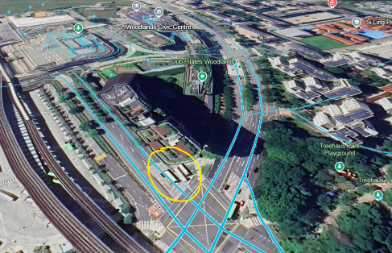

# Xiao Ming’s Adventures 2

## Image clues
Signs in the background of the first picture say "Woodlands Sq", 'Woodlands Ave 2"

 

The building pictured is Woodlands Square; going around the building in Google Street View and searching for a junction with the shape shown lets you find the corner of the building depicted pretty quickly.

It’s actually a little hard to find a junction looking *exactly* like the one in the picture, because the imagery is a bit blurry and there’s stuff blocking, but it’s here:

(fun fact: some sections of street view were taken before Woodlands Square was completed, so you get a little bit of time travelling fun)

## The location
Google Street View tells us that this street is Woodlands Ave 3.

Googling "bus routes passing through woodlands avenue 3" and trying all the numbers that came up was enough to get the correct bus (960), but for completeness:

This section of the third photo shows that there is an MRT station along the route:

- Near a building with "jun" on the facade
- Near a bridge
- Possibly two words in the name; first word short, second word starting with “P”
- Possibly DT line, since there are blue panels on the glass
- Photo was taken at exit C

This station turns out to be Bukit Panjang MRT.

Googling “bus route from woodlands ave 3 to bukit panjang mrt” turned up bus 960, which is correct!

<em>Yep, there it is!</em>

