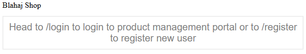
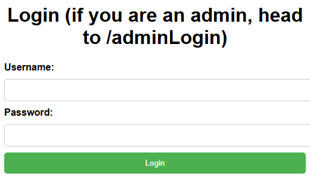
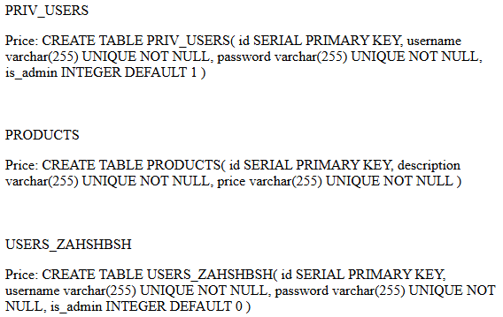

# BabySQL

A basic SQLi challenge. Try it [here](http://babysql.c1.blahaj.sg/)! (instance down)

## First look

The index page tells us that routes `/login` and `/register` exist.

`/register` was broken by the time I got to the problem (chall was a common instance; see pictures later); `/login` informs us of the existence of `/adminLogin` :0

Submitting a blank username and password (by removing the required attributes on the inputs) let me get into `/user`, which is a page with a neat little search bar for SQLi :D

### Update 25/11/2024

`/register` is working again, and the blank username/password trick doesn't work anymore. You need to actually register now.

## SQLi yay!

### Entry point

Entering `'` (single quote) into the search bar gives a 500 (while `"` doesn’t), indicating that the string fields in the query can be closed with `'`.

(side note: after your first query you'll be redirected to `/product`, but that page is functionally identical to `/user`.)

### Number of columns

To find the number of columns in the table, we do `' UNION SELECT 1, 2, 3;--` etc, and we find that there are 3 columns – most likely ID, name, and price.

### What tables are there?

It's SQLite, so `' UNION SELECT 0, name, sql FROM sqlite_master;--` works! `PRIV_USERS` is of most interest.

## Hackerman time

`' UNION SELECT 0, username, password FROM PRIV_USERS` gives us three users: Cisco, Leon and Rigby, and their password hashes.

Dropping the hashes into CrackStation cracks them easily; trying Cisco and his password ("test101") on `/adminLogin` gets us in, with the flag waiting for us!

Fun fact: there's a table `USERS_ZAHSHBSH` where you can see everyone’s attempts at SQLi to add a new user to the database :p

> Some of these may be mine.

> Real usernames, created by real players.
